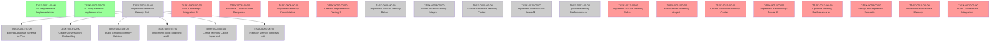

```mermaid
flowchart TD
    TASK_0001_00_00["TASK-0001-00-00<br/>P0 Requirements Implementation..."]
    style TASK_0001_00_00 fill:#99ff99
    TASK_0002_00_00["TASK-0002-00-00<br/>P1 Requirements Implementation..."]
    style TASK_0002_00_00 fill:#99ff99
    TASK_0003_00_00["TASK-0003-00-00<br/>Implement Semantic Memory Retr..."]
    style TASK_0003_00_00 fill:#cccccc
    TASK_0003_01_00["TASK-0003-01-00<br/>Extend Database Schema for Con..."]
    style TASK_0003_01_00 fill:#cccccc
    TASK_0003_00_00 --> TASK_0003_01_00
    TASK_0003_02_00["TASK-0003-02-00<br/>Create Conversation Embedding ..."]
    style TASK_0003_02_00 fill:#cccccc
    TASK_0003_00_00 --> TASK_0003_02_00
    TASK_0003_03_00["TASK-0003-03-00<br/>Build Semantic Memory Retrieva..."]
    style TASK_0003_03_00 fill:#cccccc
    TASK_0003_00_00 --> TASK_0003_03_00
    TASK_0003_04_00["TASK-0003-04-00<br/>Implement Topic Modeling and I..."]
    style TASK_0003_04_00 fill:#cccccc
    TASK_0003_00_00 --> TASK_0003_04_00
    TASK_0003_05_00["TASK-0003-05-00<br/>Create Memory Cache Layer and ..."]
    style TASK_0003_05_00 fill:#cccccc
    TASK_0003_00_00 --> TASK_0003_05_00
    TASK_0003_06_00["TASK-0003-06-00<br/>Integrate Memory Retrieval wit..."]
    style TASK_0003_06_00 fill:#cccccc
    TASK_0003_00_00 --> TASK_0003_06_00
    TASK_0004_00_00["TASK-0004-00-00<br/>Build Knowledge Integration Pi..."]
    style TASK_0004_00_00 fill:#ff9999
    TASK_0005_00_00["TASK-0005-00-00<br/>Enhance Context-Aware Response..."]
    style TASK_0005_00_00 fill:#ff9999
    TASK_0006_00_00["TASK-0006-00-00<br/>Implement Memory Consolidation..."]
    style TASK_0006_00_00 fill:#ff9999
    TASK_0007_00_00["TASK-0007-00-00<br/>Create Comprehensive Testing S..."]
    style TASK_0007_00_00 fill:#ff9999
    TASK_0008_00_00["TASK-0008-00-00<br/>Implement Natural Memory Behav..."]
    style TASK_0008_00_00 fill:#cccccc
    TASK_0009_00_00["TASK-0009-00-00<br/>Build Graceful Memory Integrat..."]
    style TASK_0009_00_00 fill:#cccccc
    TASK_0010_00_00["TASK-0010-00-00<br/>Create Emotional Memory Contex..."]
    style TASK_0010_00_00 fill:#cccccc
    TASK_0011_00_00["TASK-0011-00-00<br/>Implement Relationship-Aware M..."]
    style TASK_0011_00_00 fill:#cccccc
    TASK_0012_00_00["TASK-0012-00-00<br/>Optimize Memory Performance wi..."]
    style TASK_0012_00_00 fill:#cccccc
    TASK_0013_00_00["TASK-0013-00-00<br/>Implement Natural Memory Behav..."]
    style TASK_0013_00_00 fill:#ff9999
    TASK_0014_00_00["TASK-0014-00-00<br/>Build Graceful Memory Integrat..."]
    style TASK_0014_00_00 fill:#ff9999
    TASK_0015_00_00["TASK-0015-00-00<br/>Create Emotional Memory Contex..."]
    style TASK_0015_00_00 fill:#ff9999
    TASK_0016_00_00["TASK-0016-00-00<br/>Implement Relationship-Aware M..."]
    style TASK_0016_00_00 fill:#ff9999
    TASK_0017_00_00["TASK-0017-00-00<br/>Optimize Memory Performance wi..."]
    style TASK_0017_00_00 fill:#ff9999
    TASK_0018_00_00["TASK-0018-00-00<br/>Design and Implement Semantic ..."]
    style TASK_0018_00_00 fill:#ff9999
    TASK_0019_00_00["TASK-0019-00-00<br/>Implement and Validate Memory ..."]
    style TASK_0019_00_00 fill:#ff9999
    TASK_0020_00_00["TASK-0020-00-00<br/>Build Conversation Integration..."]
    style TASK_0020_00_00 fill:#ff9999

```